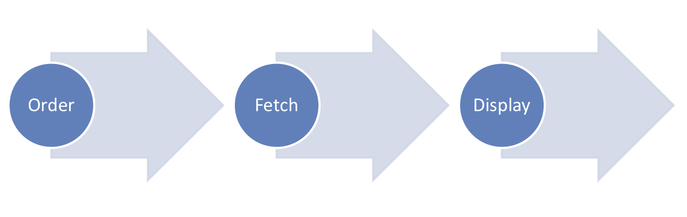
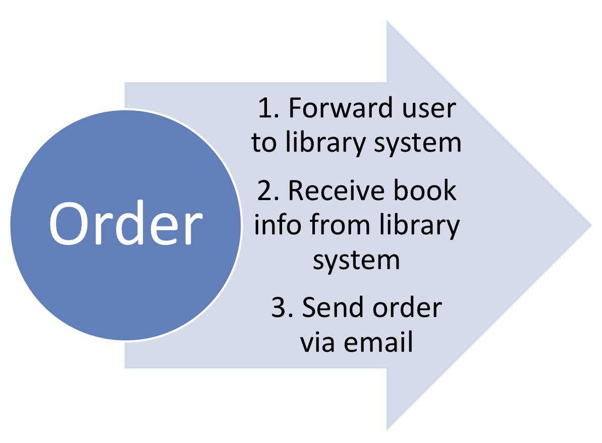
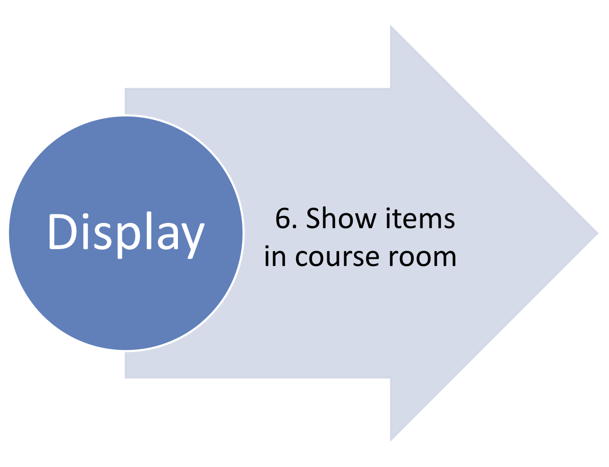

digisem-docs
============

Digisem can be used to integrate moodle with library systems in order to digitalize and publish library items such as books, articles and so on. From ordering a specific item, publishing it in the moodle course and displaying it to the users, it involves quite a number of steps and thus challenges. The following story tries to sum up the most important ones:

<strong>Background Story</strong>

<ol>
<li>Bob teaches at the local university. He wants to setup a course room in moodle for his lecture on economics. He wants to provide the mandatory book chapters as digital copies in the course room. He also wants them to be assigned to the correct weeks. </li>
<li>Ideally, Bob thinks, after he ordered the copies and assigned them to the correct weeks, he should not have anything further to do. This means, the library gets informed about his request and executes it. When the digital copy is ready, it should be automatically published in the course. </li>
<li>As long as the digital copies have not been published in the course room, Bob expects that he can see the request details and status, but his students cannot. They see the copies after they arrived. </li>
<li>Alice from the library scans and publishes books as PDFs. She needs the library ID of each book and the pages to scan. Unfortunately, Bob has the books on his own and does not know their library IDs. </li>
</ol>

<strong>Process Design</strong>

So how does digisem work? 

In the image below you see the three main processes. First, the course owner (or teacher) orders a digital copy from the library. Then the library processes the request. In the second step, the digisem plugin fetches the copy and publishes it in the course room. In the last step the students can display the copy such as they would view any other module (in moodle terms of speaking). 

How do I order a digital copy? 

First, the course owner orders a digital copy. Whether he starts in the moodle course or in the library catalogue does not make any difference. (Please refer to the screenshots section for more details!)

If he starts in the moodle course room, he justs adds another resource of the type digisem. Thereafter the he chooses a name and is then forwarded to the library catalogue. Here he selects the item and the library catalogue offers an option to go back to moodle. The course owner is then forwarded back to the moodle course room. (This is somehow magic at this point and we will come back to this point later in the Integration section.)</li>

Now he sees all the necessary information in the "add a digisem" form. He adds the pages he is interested in and creates the digisem. 

How does the plugin publish the copy in the course room? 

As you will read in the Integration section below, there is another contract with the library system regarding the publication of digital copies. We decided to use FTP and a cronjob. 

Then it works as follows: The library receives an email containing all the necessary information. Additionally, there is also a unique identifier included in the information. When the copy is ready, it is placed on a FTP share with the unique identifier as name. 

The moodle cron triggers the cronjob of the digisem plugin regularly. The cronjob reads all files from the FTP shares and compares them to the open requests. If there is a match, the file is loaded from the FTP and integrated into the moodle file system. 

When do the students see the digital copy? 

Every digital copy (request) has a status. Either it is ordered or delivered. When the copy was successfully loaded from the FTP of the library, the status is set to delivered. 

From this moment on, the students of the course can see the copy. 

