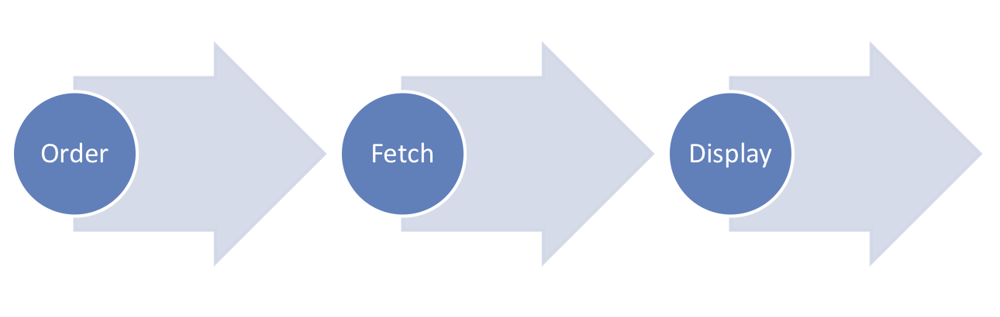
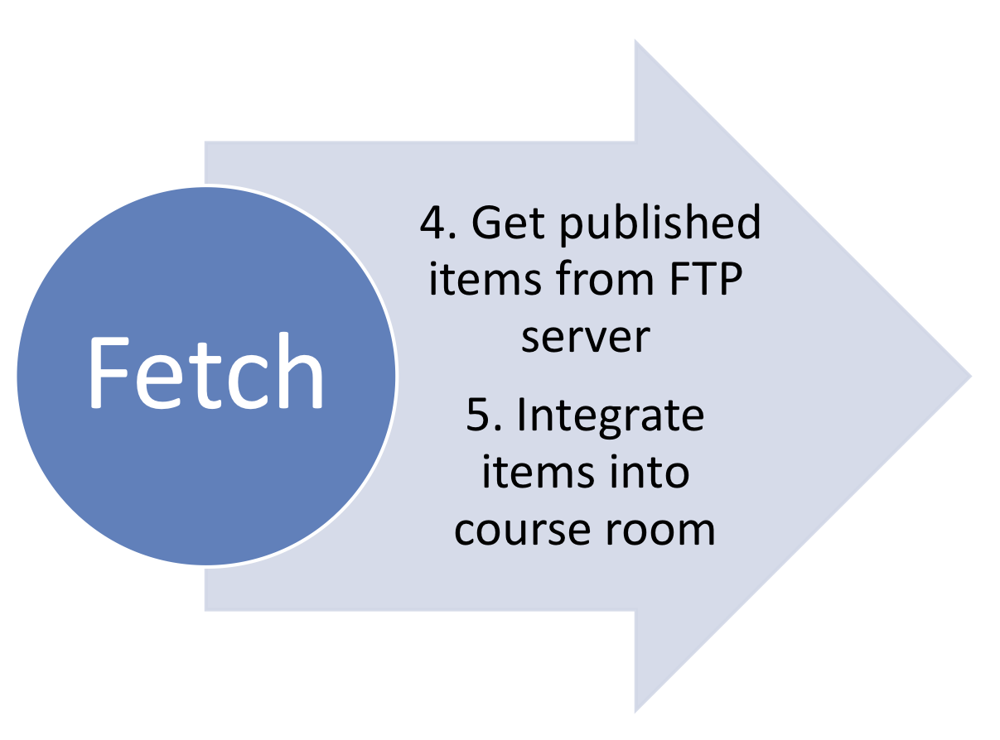
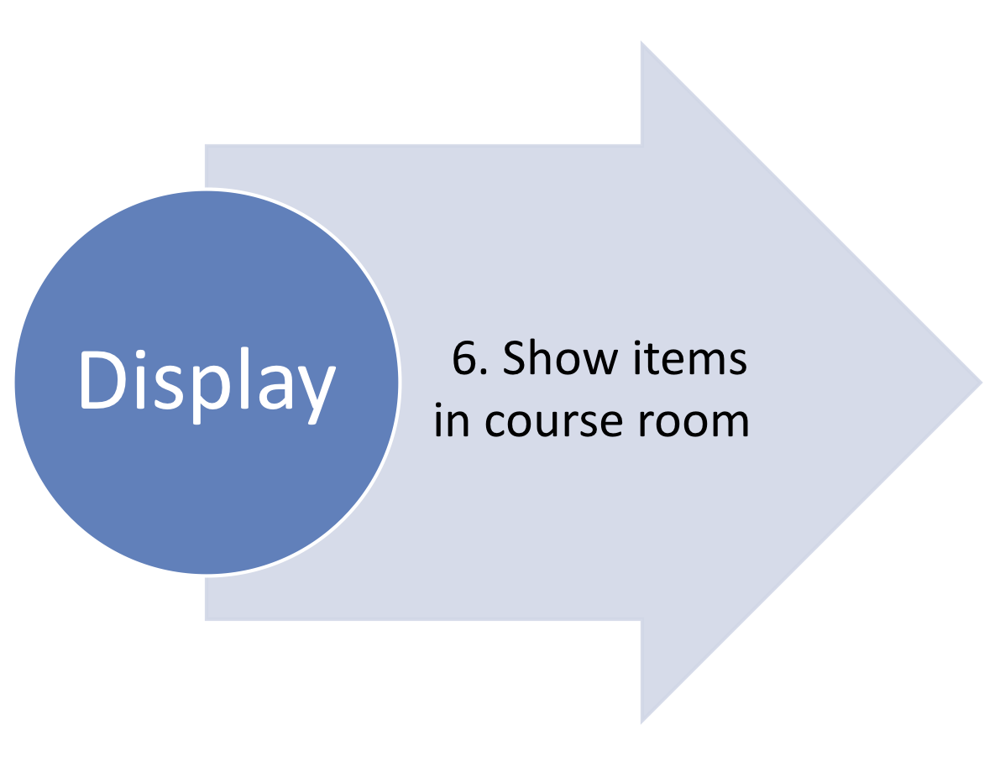

Digisem Introduction
============

Digisem can be used to integrate moodle with library systems in order to digitalize and publish library items such as books, articles and so on. From ordering a specific item, publishing it in the moodle course and displaying it to users, it involves quite a number of steps and thus challenges. The following story tries to sum up the most important ones:

<strong>Background Story</strong>

<ol>
<li>Bob teaches at the local university. He wants to set up a course room in moodle for his lecture on economics. He wants to provide the mandatory book chapters as digital copies in the course room. Also, he wants to assign them to the correct weeks so that his students know what to read. </li>
<li>Ideally, Bob thinks, after he ordered the copies and assigned them to the correct weeks or slots, he should not have anything further to do. This means, the library gets informed about his request and executes it. When the digital copy is ready, it should be automatically published in the course. </li>
<li>As long as the digital copy has not been published in the course room, Bob expects that he can see the request details and status, but his students cannot. They see the copy after it has arrived. </li>
<li>Alice from the library scans and publishes books as PDFs. She needs the library ID of each book to find it and the pages to scan. Unfortunately, Bob does not know the library IDs of the books he owns himself. </li>
</ol>

The digisem plugin tries to cover all these expectations. Read in the section about Process Design below how it works in principle. The sections on the next pages describe how to <a href="https://github.com/digisem/digisem-docs/blob/master/Integration.md">integrate the plugin</a> and show <a href="https://github.com/digisem/digisem-docs/blob/master/Screenshots.md">screenshots</a>. 

<strong>Process Design</strong>

So how does digisem work? 

In the image above you see the three main processes. First, the course owner (or teacher) orders a digital copy from the library. Thereafter the library processes the request. In the second step, the digisem plugin fetches the copy and publishes it in the course room. In the last step the students can open the copy such as they would view any other module (in moodle terms of speaking). 

How do I order a digital copy? 

First, the course owner orders a digital copy. Whether he starts in the moodle course or in the library catalogue does not make any difference. (Please refer to the <a href="https://github.com/digisem/digisem-docs/blob/master/Integration.md">Integration section</a> for more details!)

If he starts in the moodle course room, he justs adds another resource of the type Digisem. Thereafter he chooses a name and is then forwarded to the library catalogue. He selects the item in the catalogue which afterwards offers an option to go back to moodle. The course owner is then forwarded back to the moodle course room with the item information. (This is somehow magic at this point and we will come back to this later in the Integration section.)</li>

Now he sees all the necessary information in the moodle dialog to add a new module. He provides the page numbers he is interested in and creates the digisem. 

How does the plugin publish the copy in the course room? 

As you will read in the Integration section below, there is a contract with the library system regarding the publication of digital copies. We decided to use email, FTP and a cronjob. 

Then it works as follows: The library receives an email containing all the necessary information when the course owner created the digisem. A unique identifier for the digisem is included in the email. When the copy is ready, it is placed on a FTP share with the unique identifier as name. 

The moodle cron triggers the cronjob of the digisem plugin regularly. The cronjob reads all files from the FTP shares and compares them to the open requests. If there is a match, the file is loaded from the FTP and integrated into the moodle file system. 

When do the students see the digital copy? 

Every digital copy (request) has a status. Either it is ordered or delivered. When the copy was successfully loaded from the FTP of the library, the status is set to delivered. 

From this moment on, the students of the course can see the copy. 

Also there are some additional "cherries": The digital copy is also available in the course owner's own files. This means that it can be freely inserted in other courses as well. Also, the course owner is informed via email when the digital copy has arrived. 

But what happens, if Alice from the library could not process the order successfully?

Well good question :). This is up to you as process designer. The digisem plugin ships the email address (and contact info) from the requesting course owner with the order email. But there is no automatic cancellation of digisems in case of an error yet. Maybe in the future? 

NEXT: <a href="https://github.com/digisem/digisem-docs/blob/master/Integration.md">Integration or "what do I have to do to get the digisem plugin working"?</a>

